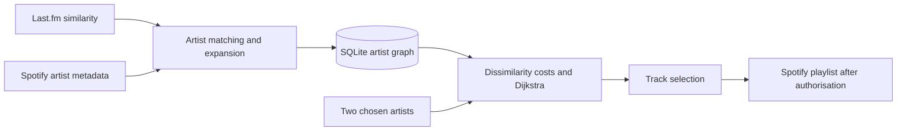

# Nettspend to Sauti Sol

Find a route between music artists through a weighted similarity graph, then use the artists along that route to build a Spotify playlist.

The project combines a C#/.NET backend, SQLite storage, Last.fm similarity data, Spotify artist matching, and Dijkstra's shortest-path algorithm.

[Read the original project report](docs/Nett-SautiSol%20Project.pdf) · [Graph model and assumptions](docs/MODEL.md)

## How it works

1. The network expander asks Last.fm for similar artists.
2. It matches artists against Spotify, checking track overlap and applying a popularity filter.
3. Artist identities and raw similarity scores are stored in SQLite.
4. The backend converts similarity into traversal cost and finds a minimum-cost route.
5. The playlist services select tracks and, after Spotify authorisation, create a playlist in the user's account.



## The graph model

Last.fm defines a similarity score `s` between 0 and 1, where higher values mean greater similarity. The traversal cost is:

```text
cost(u, v) = 1 - similarity(u, v)
route cost = sum of its edge costs
```

For example, two links with similarity 0.9 each cost 0.2 in total. A direct link with similarity 0.2 costs 0.8. The first route is preferred.

This is an explicit modelling choice. It does not establish that the route is the most enjoyable playlist, and the scores are not calibrated probabilities. The current model treats stored connections as undirected. See [MODEL.md](docs/MODEL.md) for assumptions, limitations, and evaluation ideas.

The included database snapshot contained **1,246 artists and 2,605 connection rows** when checked on 15 September 2026. The database continues to store the original similarity values; converting to cost does not rewrite those values.

## Status

The .NET backend builds, 14 graph checks and 9 Spotify checks pass, and local API checks cover successful routes, unknown artists, invalid requests and expired sign-ins. A live read-only Spotify check authenticated successfully and selected 27 songs for the 11-artist Nettspend → Cleo Sol route. The full browser flow was then verified: fresh Spotify sign-in created a public Nettspend → Cleo Sol playlist with 27 songs (about 1 hour 15 minutes), visible in Spotify. The project remains a prototype, with compiler warnings and ingestion limitations.

The existing static frontend is in `NettspendToSautiSol/website/website`. The C# `website` entry point is empty; serve the frontend files directly using the instructions below.

## Build and check

Requirements: **.NET 8 SDK** and network access to NuGet for the first dependency restore. Run these commands from the repository root:

```sh
dotnet build NettspendToSautiSol/NettspendToSautiSol.sln
dotnet run --project tests/Pathfinding.Checks
dotnet run --project tests/Spotify.Checks
```

Both check runners work without Spotify or Last.fm credentials. The Spotify checks use simulated HTTP responses to verify current endpoints, ordered batches of at most 100 songs, artist identity, duplicate filtering, rate limits, partial writes and isolated authentication headers.

The graph runner exercises the production graph classes and SQLite loader, including disconnected nodes, isolated artists, invalid scores, and zero-cost cycles. It also compares results with a separate Floyd–Warshall implementation over 1,280 source–destination cases on deterministic generated graphs. A failing check produces a non-zero exit code.

A GitHub Actions workflow is configured to build the solution and run these checks on pushes and pull requests. Hosted run results are available in the repository’s Actions tab.

## Run the connected application

Use your own valid service credentials. Previously exposed credentials must be revoked or rotated before reuse; deleting a value from the current files does not revoke it or remove it from old commits.

For a POSIX shell, start from the repository root:

```sh
cp .env.example .env
# Edit .env locally and enter your own values.
set -a
. ./.env
set +a

dotnet run --project NettspendToSautiSol/webserver/webserver \
  --no-launch-profile --urls http://localhost:5048
```

The application reads process environment variables. It does **not** load `.env` automatically. On Windows, set the equivalent environment variables in your terminal or IDE. In a restricted environment where startup stalls while watching configuration files, set `DOTNET_USE_POLLING_FILE_WATCHER=1`; this was needed for the local audit smoke check.

| Variable | Purpose |
|---|---|
| `ARTIST_DATABASE_PATH` | Absolute path to an existing artist database |
| `SPOTIFY_CLIENT_ID` | Spotify application client ID |
| `SPOTIFY_CLIENT_SECRET` | Spotify application client secret |
| `SPOTIFY_REDIRECT_URI` | Exact callback URI registered for your Spotify application |
| `LASTFM_API_KEY` | Required by the network expander |
| `ARTIST_REPORT_PATH` | Optional destination for submitted artist issues |

The example callback is `http://127.0.0.1:8080/callback.html`. In a second terminal, from the repository root, serve the frontend with Python 3:

```sh
python3 -m http.server 8080 --bind 127.0.0.1 \
  --directory NettspendToSautiSol/website/website
```

Open `http://127.0.0.1:8080`. Its API configuration currently targets `http://localhost:5048/api`. Provider access and callback registration must match your own application configuration.

### Spotify compatibility and playlist selection

The playlist flow uses `POST /me/playlists` and `POST /playlists/{id}/items`, following [Spotify's February 2026 development-mode migration](https://developer.spotify.com/documentation/web-api/tutorials/february-2026-migration-guide). The app owner needs an active Spotify Premium subscription; authorised users must have access to the development app.

Artist top-tracks is no longer available to development apps. Song selection now uses up to 10 Spotify search results per query, with the GB market as the current catalogue filter. Candidate songs must match stored Spotify artist IDs. The existing heuristic selects up to three contributions per artist, using an exact two-artist collaboration as a bridge where found, and otherwise solo tracks. A bridge consumes one slot from each artist. Solo candidates are randomised and normalised names are deduplicated, so runs can differ and fewer songs may be available. Search is not a popularity ranking or an exhaustive catalogue scan.

The HTTP client sends authentication on each request and does not store cookies. API failures are reported by stage; no suitable songs means no playlist is created. Failed writes are not automatically retried because Spotify may already have saved them. If adding songs fails after creation, the error identifies the playlist to inspect first. After a failed attempt or server restart, refresh the page and sign in again: OAuth codes and states are single-use.

### Expand the artist graph

After setting the environment variables, including `LASTFM_API_KEY`:

```sh
dotnet run --project NettspendToSautiSol/NetworkExpander/NetworkExpander
```

This operation writes to the configured database and calls external APIs. The existing expander still uses removed development-mode artist top-tracks/popularity data and needs a separate migration before it can reliably expand the graph. It starts from a hard-coded seed artist and has limited retry/checkpoint handling. Review its behaviour and provider limits before running it against a dataset you want to preserve.

## Repository map

| Path | Purpose |
|---|---|
| `NettspendToSautiSol/GlobalTypes/` | Artist identity, similarity conversion, and configuration helpers |
| `NettspendToSautiSol/DatabaseServices/` | SQLite repositories and graph loading |
| `NettspendToSautiSol/ExternalWebServices/` | Spotify and Last.fm clients and playlist services |
| `NettspendToSautiSol/NetworkExpander/` | Discovery and persistence of artist connections |
| `NettspendToSautiSol/webserver/` | HTTP API and shortest-path implementation |
| `NettspendToSautiSol/website/` | Existing static frontend |
| `tests/Pathfinding.Checks/` | Automated graph and database checks |
| `nettspendtosautisolprototyping/` | Historical experiments; separate from the main solution |
| `docs/` | Original report and model documentation |

Build outputs, downloaded dependency packages, and local environment files are ignored by Git. The original report and database are retained.

No repository-wide software licence has been selected. Review original and third-party code and assets before choosing one.
